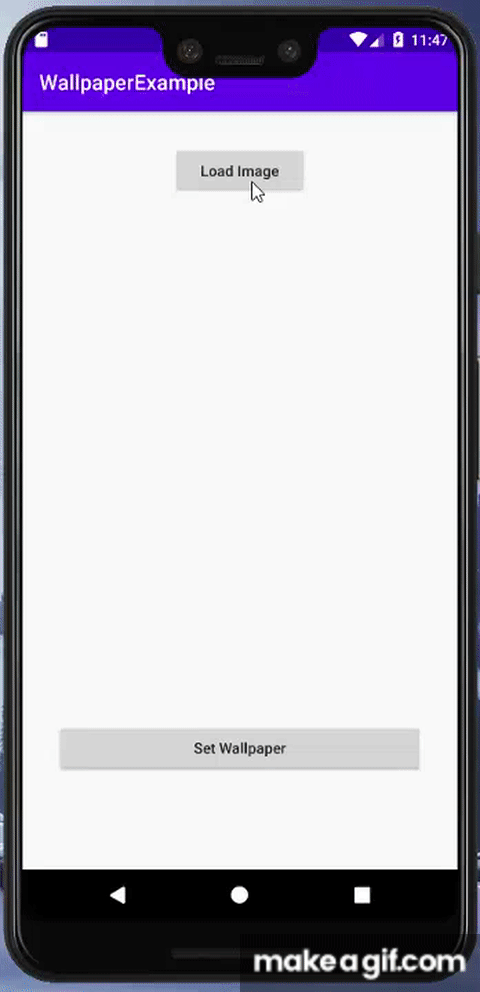

# WallpaperExample
Set an Image as Wallpaper using Glide Library in Kotlin

## Permission in the Manifest File:

```
    <uses-permission android:name="android.permission.INTERNET"/>
    <uses-permission android:name="android.permission.SET_WALLPAPER"/>
```

## Include dependencies in Gradle (Module:app):

```
    // Glide library
    implementation 'com.github.bumptech.glide:glide:3.8.0'
```


## Layout file (main_activity.xml):

```
    <Button..
    ...
    
    <ProgressBar
    android:id="@+id/progressBar"
        android:layout_width="80dp"
        android:layout_height="80dp"
        android:visibility="visible"
        ... />

    <ImageView
        android:id="@+id/ivImage"
        android:layout_width="256dp"
        android:layout_height="256dp"
        ... />
        
    <Button..
    ...
```

## Code (MainActivity):

```
    // Url
    private var url : String = "https://picsum.photos/2000"
    
    // We need to define all members and views
    private var imageView : ImageView? = null
    private var btnLoad : Button? = null
    ...
    
    // Find each view
    imageView = findViewById(R.id.ivImage)
    btnLoad = findViewById(R.id.btnDownloadImage)
    ...
    
    // Then setup listeners for each button (load image and set wallpaper buttons)
    
    btnLoad?.setOnClickListener { view ->
     ...
    }
    
    btnSetWallpaper?.setOnClickListener { view ->
     ...
    }
    
    
   // Include image into ImageView using Glide
   Glide.with(this)
        .load(imageToDownload)
        .diskCacheStrategy(DiskCacheStrategy.NONE)
        .skipMemoryCache(true)
        .into(imageView)
   
   
   Finnaly, set bitmap into Wallpaper Manager:
   
   var wallpaperManager : WallpaperManager = WallpaperManager.getInstance(applicationContext)
   var drawable : Drawable? = imageView?.drawable as Drawable
   // You can take bitmap image from any resources (web, drawable folder, etc)
   wallpaperManager?.setBitmap(drawable?.toBitmap())
```

## Final result:

## Example 1:

<p align="center">
 
</p>

## Example 2:

<p align="center">

</p>
